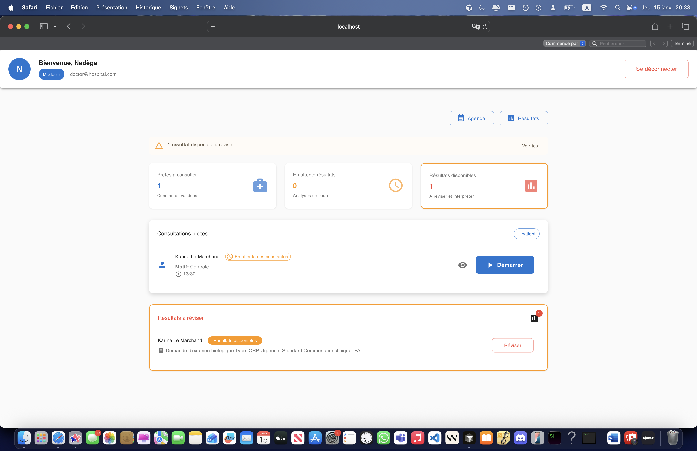
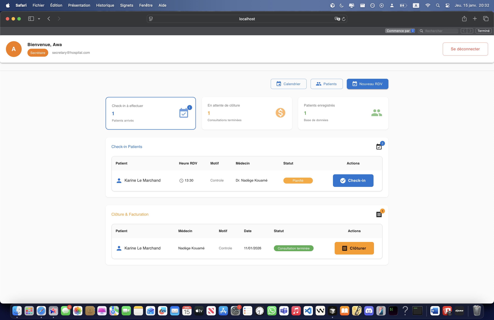
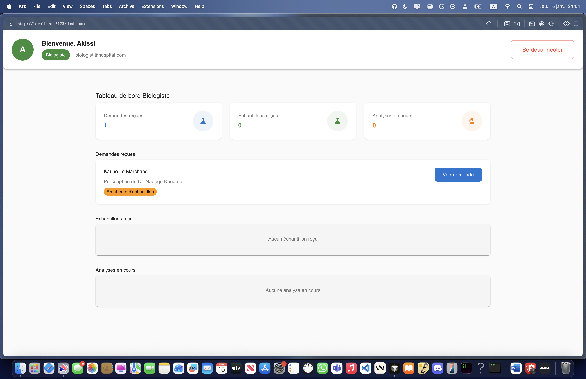

# Prototype – Système de Gestion Hospitalière (Centre cardiologique)

## Contexte

Ce projet est un **prototype fonctionnel** de système de gestion hospitalière développé pour répondre aux besoins d’un **centre cardiologique en Côte d’Ivoire**, dans un contexte de **ressources limitées** et d’infrastructure locale (réseau interne).

L’objectif était de **modéliser et implémenter un workflow médical réaliste**, de la prise de rendez-vous jusqu’au retour des résultats de laboratoire au médecin.

---

## Problème

Dans de nombreux centres médicaux locaux :

* les données patients sont dispersées ou gérées sur papier,
* le suivi des prescriptions et des résultats est fragmenté,
* la coordination entre secrétariat, médecins et laboratoire est difficile.

Ces contraintes entraînent des pertes d’information, des retards et des erreurs de suivi médical.

---

## Solution proposée

Une **application locale client-serveur** permettant de gérer l’ensemble du workflow médical :

Rendez-vous → Consultation → Prescription → Analyse laboratoire → Résultats → Suivi médical

Le système repose sur :

* des rôles métiers distincts,
* un cycle de vie clair des prescriptions,
* une interface simple et structurée adaptée à un usage quotidien.

---

## Aperçu du workflow applicatif

Chaque rôle dispose d’une interface dédiée lui permettant de visualiser uniquement les actions pertinentes selon l’état du patient et du processus médical.



---

## Fonctionnalités principales

* Gestion des patients et des rendez-vous
* Consultation médicale et création de prescriptions
* Transmission des prescriptions au laboratoire
* Saisie et validation des résultats biologiques
* Consultation des résultats par le médecin
* Gestion des rôles et des permissions (RBAC)

---

## Rôles utilisateurs

### Secrétariat

Gestion des patients, des rendez-vous et du suivi administratif des consultations.



---

### Médecin

Consultations médicales, prescriptions et interprétation des résultats biologiques.


---

### Biologiste

Réalisation des analyses biologiques et saisie des résultats dans le système.



---

### Administrateur

Gestion des utilisateurs et des rôles.

---

## Architecture technique

* Frontend : Electron, React, TypeScript, Material-UI
* Backend : Node.js, NestJS (architecture modulaire)
* Base de données : PostgreSQL (ORM Prisma)
* Déploiement : réseau local (client-serveur)

Le projet est structuré en monorepo avec une séparation claire entre frontend et backend.

---

## Modèle de données (simplifié)

* User (ADMIN, DOCTOR, BIOLOGIST, SECRETARY)
* Patient
* Appointment
* Prescription (CREATED → SENT_TO_LAB → IN_PROGRESS → COMPLETED)
* Result

Le schéma complet est disponible dans le fichier `schema.prisma`.

---

## Lancement du projet

### Prérequis

* Node.js version 18 ou supérieure
* PostgreSQL version 14 ou supérieure

### Installation

```bash
npm run install:all
npm run db:migrate
npm run db:seed
npm run dev
```

---

## Scénario démontrable

Le prototype permet de démontrer un workflow médical complet :

1. Création d’un patient et d’un rendez-vous par le secrétariat
2. Consultation médicale
3. Création et envoi d’une prescription au laboratoire
4. Analyse et saisie des résultats
5. Consultation des résultats par le médecin

---

## Statut du projet

* Statut : Prototype fonctionnel (v1)
* Livraison : workflow complet opérationnel

Limites connues :

* pas de gestion documentaire,
* pas de conformité réglementaire complète,
* pas de notifications temps réel,
* pas de version Electron packagée.

---

## Objectif

Ce projet vise à démontrer la capacité à :

* concevoir un système métier réel,
* structurer une architecture full-stack,
* livrer un prototype exploitable sous contraintes terrain.

